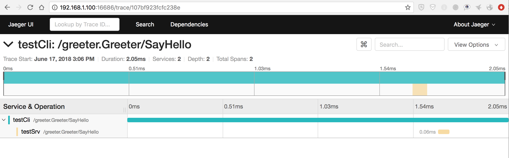

# grpc-jaeger

[](https://travis-ci.org/moxiaomomo/grpc-jaeger)
[](https://goreportcard.com/badge/github.com/moxiaomomo/grpc-jaeger)

grpc-jaeger is a kind of interceptor to gRPC implemented by Go, which is based on opentracing and uber/jaeger. You can use it to build a distributed gRPC-tracing system.

# Dependencies

```
github.com/opentracing/opentracing-go
github.com/uber/jaeger-client-go
```

# Usage

- You can use it like this on the rpc-client side

```golang
import (
	"fmt"
	"os"
	
	gtrace "github.com/moxiaomomo/grpc-jaeger"
	"google.golang.org/grpc"
)

func rpcCli(dialOpts []grpc.DialOption) {
		conn, err := grpc.Dial("127.0.0.1:8001", dialOpts...)
		if err != nil {
			fmt.Printf("grpc connect failed, err:%+v\n", err)
			return
		}
		defer conn.Close()
		
		// TODO: do some rpc-call
		// ...
}

func main() {
		dialOpts := []grpc.DialOption{grpc.WithInsecure()}
		tracer, _, err := gtrace.NewJaegerTracer("testCli", "127.0.0.1:6831")
		if err != nil {
			fmt.Printf("new tracer err: %+v\n", err)
			os.Exit(-1)
		}

		if tracer != nil {
			dialOpts = append(dialOpts, gtrace.DialOption(tracer))
		}
		// do rpc-call with dialOpts
		rpcCli(dialOpts)
}
```

- You can use it like this on the rpc-server side

```golang
import (
	"fmt"
	"os"
	
	gtrace "github.com/moxiaomomo/grpc-jaeger"
	"google.golang.org/grpc"
)

func main() {
	var servOpts []grpc.ServerOption
	tracer, _, err := gtrace.NewJaegerTracer("testSrv", "127.0.0.1:6831")
	if err != nil {
		fmt.Printf("new tracer err: %+v\n", err)
		os.Exit(-1)
	}
	if tracer != nil {
		servOpts = append(servOpts, gtrace.ServerOption(tracer))
	}
	svr := grpc.NewServer(servOpts...)
	// TODO: register some rpc-service to grpc server
	
	ln, err := net.Listen("tcp", "127.0.0.1:8001")
	if err != nil {
		os.Exit(-1)
	}
	svr.Serve(ln)
}
```

# Testing

## 1）deploy a jaeger-server

Suppose you have already deployed the jaeger server on some node,<br>
jaeger-agent address: `192.168.1.100:6831`, <br>
jaeger-ui address: `http://192.168.1.100:16686/`.

## 2）run a test

Refer to wrapper_test.go，you can just run `go test` at the same diretory:

```bash
pintai@MG:/yourpath/grpc-jaeger$ go test
2018/06/17 15:06:05 Initializing logging reporter
2018/06/17 15:06:06 Initializing logging reporter
SayHello Called.
2018/06/17 15:06:06 Reporting span 107bf923fcfc238e:1f607766f1329efd:107bf923fcfc238e:1
2018/06/17 15:06:06 Reporting span 107bf923fcfc238e:107bf923fcfc238e:0:1
call sayhello suc, res:message:"Hi im tester\n"
PASS
ok  	github.com/moxiaomomo/grpc-jaeger	3.004s
```

## 3）get the result from the UI
Open the url `http://192.168.1.100:16686/`, and search the specified service. Then you should see the result like this as below：
